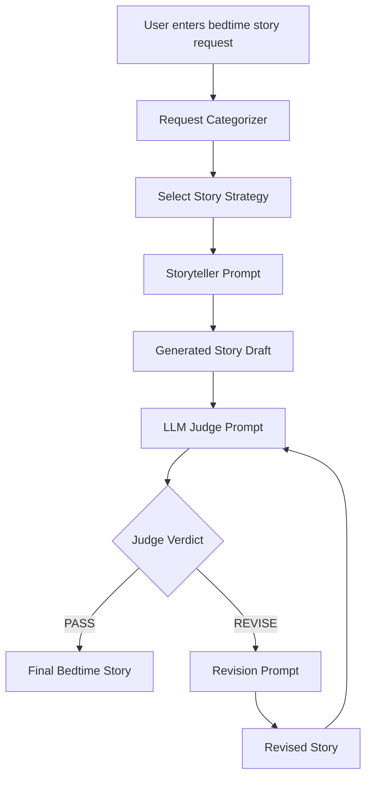

# System Design

## Overview

This project uses a storyteller-and-judge architecture to generate higher-quality bedtime stories for children ages 5 to 10.

The system takes a simple user request, categorizes the request, selects a tailored storytelling strategy, generates an initial story draft, evaluates that draft with an LLM judge, and revises the story if the judge recommends improvement.

The main goal is to show that prompt quality, structured evaluation, and a bounded revision loop can improve the final story without changing the assignment-provided model.

---

## Block Diagram



---

## Component Flow

### 1. User

The user provides a simple bedtime story request through the command line.

Example:

```text
I want to listen about flying cats. It should make me feel really cozy and put me to sleep soon.
```

The system is designed to accept flexible requests, including animals, space, friendship, comfort, adventure, and general bedtime story ideas.

---

### 2. Request Categorizer

The request categorizer uses lightweight keyword rules to classify the user's request into a story category.

Current categories include:

- `space_story`
- `animal_story`
- `friendship_story`
- `comfort_story`
- `gentle_adventure`
- `general_bedtime_story`

This step is intentionally rule-based instead of LLM-based. That keeps the system cheaper, faster, and easier to explain while still adding product behavior beyond a single prompt.

---

### 3. Story Strategy Selector

After the request is categorized, the system selects a tailored story strategy.

Examples:

- `animal_story` focuses on gentle animal personalities, cozy habits, and soft sensory details.
- `space_story` focuses on wonder, stars, moonlight, and peaceful exploration.
- `comfort_story` focuses on slower pacing, reassurance, and emotional safety.
- `gentle_adventure` keeps the journey magical, low-stakes, and not scary.

The selected strategy is inserted into the storyteller prompt so the generated story is better matched to the user's request.

---

### 4. Storyteller Prompt

The storyteller prompt asks the model to act as a gentle bedtime storyteller for children ages 5 to 10.

The prompt includes:

- The original user request
- The detected story category
- The tailored story strategy
- A gentle story arc
- Age and safety constraints
- A target length of about 300 to 450 words

The story arc is:

1. Cozy introduction
2. Small problem, wish, or curiosity
3. Kind or brave action
4. Peaceful resolution
5. Sleepy final image

This structure helps the story feel complete while still staying calm enough for bedtime.

---

### 5. Generated Story Draft

The first generated story is treated as a draft, not the final answer.

This is important because the project is not just a single prompt. The first draft gets reviewed by a separate judge prompt before being accepted.

---

### 6. LLM Judge Prompt

The judge prompt asks the same model to act as a children's content quality judge.

The judge evaluates the story using seven criteria:

1. Age appropriateness
2. Bedtime tone
3. Safety
4. Clarity
5. Creativity
6. Emotional warmth
7. Request following

The judge returns a structured response in this format:

```text
AGE_APPROPRIATENESS: <score>/10
BEDTIME_TONE: <score>/10
SAFETY: <score>/10
CLARITY: <score>/10
CREATIVITY: <score>/10
EMOTIONAL_WARMTH: <score>/10
REQUEST_FOLLOWING: <score>/10
VERDICT: <PASS or REVISE>
FEEDBACK: <specific feedback or None>
```

The structured format makes the output easier to parse in Python and makes the quality-control process visible to the user.

---

### 7. Judge Parser

The parser reads the judge output line by line and extracts:

- Scores
- Verdict
- Feedback

The parser intentionally stays simple. It skips malformed lines instead of crashing, which makes the command-line tool more forgiving if the model does not perfectly follow the requested format.

---

### 8. Revision Prompt

If the judge returns `REVISE`, the system sends the current story, original request, detected category, category strategy, and judge feedback into the revision prompt.

The revision prompt asks the model to improve the story while preserving:

- The original request
- The calm bedtime tone
- Age appropriateness for children ages 5 to 10
- Clear beginning, middle, and end
- Safe and comforting content

The revised story is then sent back to the judge.

---

### 9. Revision Loop

The revision loop runs for at most 2 rounds.

This limit prevents infinite loops, controls API cost, and keeps the system predictable. If the story passes earlier, the loop stops immediately.

---

### 10. Final Story Output

Once the judge returns `PASS`, or once the maximum revision count is reached, the final story is printed to the terminal.

The system prints the judge scores and verdicts during processing so the quality-control loop is visible. The final output is clearly separated as the polished bedtime story.

---

## Model Choice

The project preserves the assignment-provided model:

```text
gpt-3.5-turbo
```

The model name is stored in a constant:

```python
MODEL_NAME = "gpt-3.5-turbo"
```

This makes it easy to verify that the model was not changed.

The same model is used for three different roles:

1. Storyteller
2. Judge
3. Reviser

The role behavior changes through prompting rather than through model changes.

---

## Prompt Flow

The prompt flow is:

```text
User Request
    ↓
Request Categorization
    ↓
Category-Specific Story Strategy
    ↓
Storyteller Prompt
    ↓
Initial Story Draft
    ↓
Judge Prompt
    ↓
PASS or REVISE
    ↓
Revision Prompt if needed
    ↓
Final Bedtime Story
```

---

## Design Tradeoffs

### Rule-Based Categorization vs. LLM Categorization

I chose rule-based categorization because it avoids an extra API call and keeps the system simple. It also makes the behavior easy to explain in an interview.

An LLM-based classifier could be more flexible, but it would add cost, latency, and another failure point.

---

### Structured Judge Output vs. Freeform Feedback

The judge is asked to return a fixed key/value format. This makes the response easier to parse and makes the quality criteria explicit.

A freeform judge response might sound more natural, but it would be harder to reliably use in a revision loop.

---

### Bounded Revision Loop

The system limits revisions to 2 rounds.

This prevents infinite loops and keeps API usage predictable. For this project size, 2 rounds is enough to demonstrate the judge/reviser pattern without overengineering the assignment.

---

### Same Model for All Roles

The same model is used for storyteller, judge, and reviser to preserve the assignment requirement. Different system behaviors are created through different prompts.

This shows how prompt design can create multiple agent roles without changing the underlying model.

---

## Evaluation Alignment

### Prompt Quality

The project uses separate prompts for generation, evaluation, and revision. Each prompt has a clear role and specific output expectations. The storyteller prompt uses age, tone, safety, and structure constraints. The judge prompt uses a structured rubric. The revision prompt uses targeted judge feedback.

---

### Code Quality

The code is organized into small functions:

- `call_model()`
- `categorize_request()`
- `get_category_strategy()`
- `generate_story()`
- `judge_story()`
- `_parse_judge_output()`
- `revise_story()`
- `_print_scores()`
- `main()`

This keeps the program readable and easy to explain.

The API key is loaded from a local `.env` file and is never hardcoded.

---

### Creativity & Product Thinking

The system goes beyond a one-shot story prompt by adding:

- Request categorization
- Tailored story strategies
- A structured LLM judge
- Judge-visible scores
- A bounded revision loop
- A clear future path for parent controls and multi-turn story editing

This makes the project feel more like a small product pipeline than a single LLM call.

---

## Future Improvements

With more time, I would add:

1. Multi-turn story editing where the user can ask for a sequel, shorter version, or different main character.
2. Parent controls for reading level, length, and themes to avoid.
3. Score tracking across revisions to show whether the judge loop improved the story.
4. More categories and richer story strategies.
5. Optional saving of final stories to local `.txt` files.
6. Unit tests for the request categorizer and judge parser.
7. A simple web UI for parents or children.
